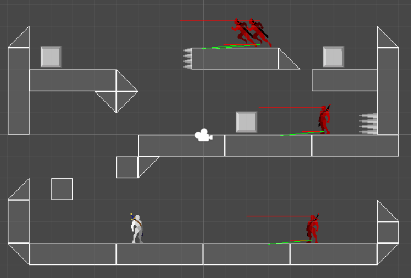

# 🎮 Prototype 

This is a sample **2D Platformer Game** unity project for learning and prototyping purposes. 
It features some basic 2D game stuff for unity.

## 🎯 Objectives

- [x] **🚀 Movement:**
    - [x] **🏃 Platformer Movement _using [Physics 2D](https://docs.unity3d.com/Manual/Physics2DReference.html)_:**
        - [x] Horizontal Movement.
        - [x] Vertical Movement (Jump).
    - [x] **🎞️ Movement Animations using [Animator](https://docs.unity3d.com/Manual/AnimatorWindow.html).**

- [x] 🔌 **Mechanism:**
    - 🚪 **Switches and Doors Mechanism:**
        - [x] Switch for Multiple Doors.
        - [x] Door for Multiple Switches.
        - [x] Switch and Door Animations _by [Animating Transform Properties](https://docs.unity3d.com/Manual/animeditor-AnimatingAGameObject.html)_.

- [x] 🤺 **Combat:**
    - [x] **💥 Explosion Effect _using [Physics 2D](https://docs.unity3d.com/Manual/Physics2DReference.html)_.** 
    - [x] **🎞️ Damage Animations.**
    - [x] **🏹 Projectile Throwing by [Instantiating Objects](https://docs.unity3d.com/ScriptReference/Object.Instantiate.html).**

- [x] **🤖 Artificial Intelligence (AI):**
    - **🏃 Automated Platformer Movement:**
        - [x] Automated Horizontal Movement.
    - [x] **👁️ Detections using _[Physics 2D LineCast](https://docs.unity3d.com/ScriptReference/Physics2D.Linecast.html)_:**
        - [x] Wall Detection for Turning Round.
        - [x] Floor Detection for Gap Avoidance.
        - [x] Player Detection for Chase.
    - [x] **🏹 Automated Projectile Throwing.**

- [ ] **🏕️ Environment:**
    - [x] **🗺️ Map:**
        - [x] Tile-Mapping _by [Nesting Objects](https://docs.unity3d.com/Manual/Hierarchy.html) (Classic)_.
        - [x] Tile-Mapping _using [TileMap Components](https://docs.unity3d.com/Manual/class-Tilemap.html)_.
    - [x] **🎥 Camera:**
        - [x] Player-Follower Camera.
        - [x] Smooth Camera Movement _using [Linear interpolation (Lerp)](https://en.wikipedia.org/wiki/Linear_interpolation)_.
        - [x] Pixel Perfect Camera _using [Pixel Perfect Camera Component](https://docs.unity3d.com/Packages/com.unity.2d.pixel-perfect@1.0/manual/index.html)_.
    - [x] **💡 Light:**
        - [x] Lighting _using [Light Components](https://docs.unity3d.com/Manual/Lights.html) (3D)_.
        - [ ] Lighting _using [Light 2D Components](https://docs.unity3d.com/Packages/com.unity.render-pipelines.universal@12.0/manual/Lights-2D-intro.html) through [Universal Render Pipeline (URP)](https://docs.unity3d.com/Packages/com.unity.render-pipelines.universal@12.0/manual/index.html)_.
    - [ ] **📣 Sound:**
        - [ ] Background Music.
        - [ ] Background Sound.
        - [ ] Sound Effects.

- [ ] **🔲 User Interface (UI):**
    - [ ] **💯 Head-Up Display (HUD):**
        - [ ] Health Bar.
        - [ ] Score Counter.
    - [ ] **🖼️ Title Menu:**
        - [ ] 🚧 ...
        - [ ] 🚧 ...
        - [ ] 🚧 ...
    - [ ] **⚙️ Settings Menu :**
        - [ ] 🚧 ...
        - [ ] 🚧 ...
        - [ ] 🚧 ...

## 🏭 Environment

- Runtime: **[Windows](https://www.microsoft.com/en-us/windows) 10**
- Game Engine: **[Unity](https://unity.com) 2022**
- Scripts Language: **[C#](https://github.com/dotnet/csharplang) 9.0**
- Scripts Editor: **[Visual Studio](https://visualstudio.microsoft.com) 2022**

## 📚 Learning Resources

- 📕 [Unity Documentation](https://docs.unity.com)
- 📼 [Game Dev Beginner](https://www.youtube.com/@GameDevBeginner/videos)
- 📼 [Unity 4 2D Essential Training](https://www.linkedin.com/learning/unity-4-2d-essential-training)

## 📄 License
[MIT](./LICENSE)