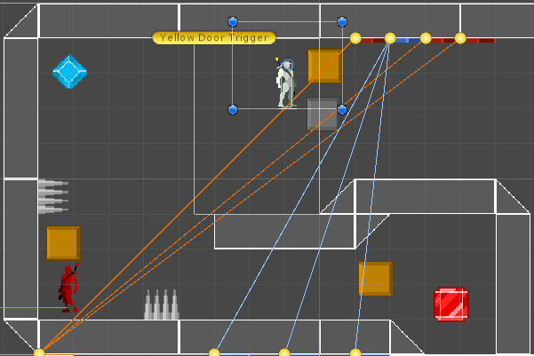

# 🎮 Prototype 

This is a sample **2D Platformer Game** unity project for learning and prototyping purposes. 
It features some basic 2D platformer stuff for unity.

## 🎯 Objectives

- [x] 🏃 Platformer Movement:
    - [x] Horizontal Movement Logic.
    - [x] Vertical Movement (Jump) Logic.
    - [x] Movement Animations.
- [x] 🚪 Switches and Doors Mechanism.
    - [x] Switch Logic and Animations.
    - [x] Door Logic and Animations.
    - [x] Switch for Multiple Doors Support.
    - [x] Door with Multiple Switches Support.
- [x] 💥 Damage:
    - [x] Explosion Effect.
    - [x] Damage Animations.
- [ ] 🤖 Enemy AI Platformer Movement:
    - [x] Automated Horizontal Movement Logic.
    - [x] Wall Detection for Turning Round.
    - [x] Floor Detection for Gap Avoidance.
    - [ ] Automated Attack.

## 🏭 Environment

- Runtime: **[Windows](https://www.microsoft.com/en-us/windows) 10**
- Game Engine: **[Unity](https://unity.com) 2022**
- Scripts Language: **[C#](https://github.com/dotnet/csharplang) 9.0**
- Scripts Editor: **[Visual Studio](https://visualstudio.microsoft.com) 2022**

## 📚 Learning Resources

- 📕 [Unity Documentation](https://docs.unity.com)
- 📼 [Game Dev Beginner](https://www.youtube.com/@GameDevBeginner/videos)
- 📼 [Unity 4 2D Essential Training](https://www.linkedin.com/learning/unity-4-2d-essential-training)

## 📄 License
[MIT](./LICENSE)